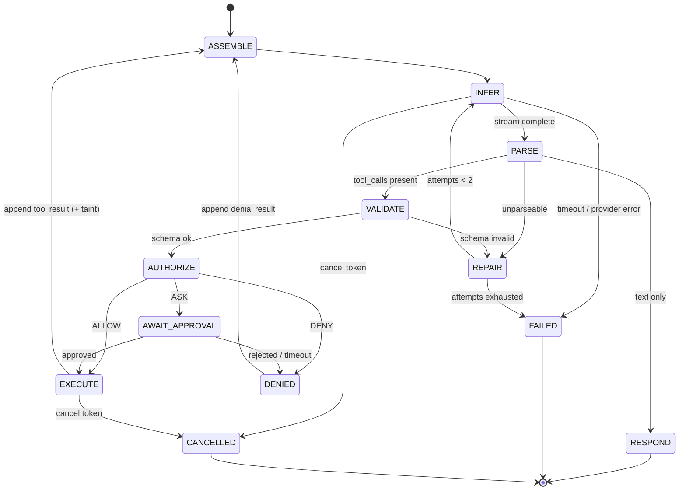

# ARTEMIS — Agent, Model Abstraction, Context, Tasks

## 1. Responsibility & boundaries

The **Agent orchestrator** turns a user turn into (a) streamed text and/or (b) a bounded sequence of policy-gated tool calls, emitting typed events throughout.

It owns: the loop, budgets, cancellation, malformed-output repair, taint propagation, event emission.

It does **not** own: OS access (tool runtime), authorization (policy engine), prompt content selection (context assembler), model wire formats (providers).

**No agent framework.** No LangChain / LlamaIndex / AutoGen. Reason: the loop below is ~300 lines, we need exact control over cancellation, token budgets and taint, and those frameworks inject opaque prompts and churn dependencies. See ADR-004.

---

## 2. The loop



### Guards (all enforced in code, all configurable, none negotiable by the model)

| Guard | Default | Effect on breach |
|---|---|---|
| `max_steps` (model inference rounds per turn) | 6 | End turn, `agent.error{code:MAX_STEPS}`, tell the user what was accomplished |
| `turn_wall_clock_s` | 120 | Cancel everything in flight, partial result marked incomplete |
| `first_token_timeout_s` | 20 | Abort inference, `MODEL_TIMEOUT` |
| `max_repair_attempts` | 2 | `TOOL_CALL_UNPARSEABLE` |
| `max_side_effect_calls_per_turn` | 5 | Further side-effecting calls forced to ASK with a "budget exceeded" notice |
| `max_parallel_tool_calls` | 1 (Phase 4) → 3 read-only (Phase 8) | Extra calls serialized |
| Loop guard | 3 identical `(tool, sha256(canonical_args))` | End turn, `REPEATED_TOOL_CALL` |
| Per-tool timeout | declared by the tool, ≤60 s | `ToolResult{status:"timeout"}` |

`max_steps` is a *round* counter, not a tool counter — one round may legitimately contain several read-only calls.

### Cancellation

Cancellation must be **immediate and observable**, not best-effort.

- Every run has a `CancelScope` (`anyio`) + a `run_id`.
- WS `run.cancel{run_id}` → cancel scope → provider HTTP stream aborted (Ollama drops generation) → running tool cancelled.
- **Inline tools** (async or short thread work) rely on cooperative cancellation.
- **Blocking or slow tools run in a subprocess** precisely so cancellation is real: the child's process tree is terminated. This is the reason for the two-tier tool runtime (`tools.md` §4) — Python cannot kill a thread stuck in a blocking Win32 call. This was a design-changing realization; see risk **R4**.
- Already-committed side effects are **not** rolled back. The cancellation result explicitly reports what had already completed. No pretending.
- Barge-in (voice, Phase 7) issues the same `run.cancel` plus TTS stop.

### Retries

- Provider connection errors: 1 retry, 250 ms backoff. Not on timeouts (they cost 20 s already).
- Malformed output: repair loop, ≤2, with the exact validation error appended as a system message.
- Tool errors: fed back once so the model can adapt (e.g. wrong path → search instead). A second failure of the *same tool* in the same turn ends the turn.
- Never auto-retry a side-effecting tool. A partially-completed destructive op must not be replayed.

---

## 3. Model abstraction

Deliberately minimal: one async streaming method, one capability descriptor, one normalized chunk union.

```python
# backend/artemis/models/base.py   (illustrative signatures only)

class Capabilities(TypedDict):
    streaming: bool
    tools: bool            # native tool/function calling
    structured_output: bool # constrained JSON
    reasoning: bool        # emits a separate thinking channel
    vision: bool
    context_window: int
    recommended_num_ctx: int

@dataclass
class Chunk:
    kind: Literal["content", "reasoning", "tool_call", "usage", "done"]
    text: str | None = None
    tool_call: ToolCall | None = None
    usage: Usage | None = None
    finish_reason: str | None = None

class ModelProvider(ABC):
    name: str
    capabilities: Capabilities

    @abstractmethod
    async def stream(
        self,
        messages: list[Message],
        tools: list[ToolSchema] | None,
        options: GenOptions,          # temperature, num_ctx, max_tokens, stop, seed
    ) -> AsyncIterator[Chunk]: ...

    @abstractmethod
    async def health(self) -> ProviderHealth: ...

    @abstractmethod
    async def count_tokens(self, messages: list[Message]) -> int: ...
```

Three concrete providers by Phase 10:
`OllamaProvider` (Phase 2) · `FakeProvider` (Phase 2, test-only, scriptable) · `VisionProvider` (Phase 10, separate registry entry, separate model).

### Why the `reasoning` channel is a first-class concept

Qwen3 emits `<think>…</think>`. If that lands in `content` it corrupts the transcript, poisons summaries and memory extraction, and looks broken in the UI.

**Rule:** providers strip and re-emit thinking as `kind="reasoning"`. Reasoning text is streamed to the UI (collapsible), **never persisted into `messages.content`**, **never fed back** into subsequent context, and **never used for memory extraction**.

### Tool-call extraction fallback chain

Small local models are unreliable at strict tool-call formats. The provider tries, in order, and records which path succeeded (`audit`/metrics — a drift signal when a model is swapped):

1. Native Ollama `tool_calls` in the response object.
2. Constrained decoding: re-request with `format=<json-schema>` when a tool call is structurally expected.
3. Text extraction: balanced-brace JSON scan for `{"tool": ..., "arguments": {...}}`, tolerant of fenced code blocks.
4. Fail → repair loop.

Every extracted call is then validated against the tool's JSON Schema. **Extraction never implies authorization.**

### Model registry & replacement

Models are declared in config, not code:

```toml
[[models]]
id = "qwen3-8b"
provider = "ollama"
model = "qwen3:8b"
role = "primary"        # primary | fast | vision | embedding
num_ctx = 8192
capabilities = { tools = true, reasoning = true, vision = false }
```

Roles decouple the app from any model name. `primary` handles chat/tools; `fast` (e.g. a 1.5–3 B model, Phase 6) handles memory extraction, summarization and tool routing so the big model isn't reloaded for chores; `vision` is loaded on demand and **swapped with** `primary` (6 GB VRAM cannot hold both). `embedding` is optional (Phase 6+).

Prompt templates live in `models/prompts/` keyed by `role`, with a per-model override directory. Swapping a model = editing config (+ optionally one prompt file). Acceptance test for replaceability: the Phase-4 tool suite must pass against a second, non-Qwen model before Phase 8 begins.

---

## 4. Context assembly

**Hard rule: never send whole history or whole memory.** The assembler is deterministic, budget-driven, and fully logged.

```
usable = num_ctx - reserve_output_tokens - safety_margin(256)
```
With `num_ctx=8192` → ≈ 6.9 k tokens for input.

| Tier | Content | Cap | Evictable |
|---|---|---|---|
| 0 | System instructions + persona | 500 | never |
| 1 | Tool schemas (compact form, selected subset) | 900 | trim to essential tools |
| 2 | Pinned profile + active preferences | 300 | never (it *is* the personalization) |
| 3 | Retrieved memories (≤5, scored) | 400 | yes, lowest-score first |
| 4 | Rolling conversation summary | 500 | yes |
| 5 | Recent verbatim turns (newest-first fill) | remainder | oldest first |
| 6 | Current task state + recent tool results | 1200 | yes, oldest results first |

Eviction order when over budget: 6 → 3 → 4 → 5 → 1. Tiers 0 and 2 are inviolable. Every assembly logs `{tier: tokens}` and any eviction.

### Token counting

Real tokenizer counts are unavailable without loading the model's tokenizer. Use a calibrated heuristic (`len(text)/3.6` for English, +15 % for code/JSON) and treat the safety margin as the error absorber. If `count_tokens` is cheap for the provider, prefer it for the final assembled prompt only (one call, not per-tier).

### Anti-bloat mechanisms

1. **Tool result truncation.** Full results go to `tool_results` + blob storage. Context gets a *view*: ≤600 tokens, structure-preserving (first N rows, counts, aggregates), ending in `…truncated, 412 more items. result_id=r_8f2a` plus a `read_more(result_id, offset)` tool. A directory listing of 5 000 files must never enter the prompt.
2. **Tool schema pruning.** Compact schema rendering (no descriptions of optional params beyond one line). From Phase 6, a `fast`-role tool router picks ≤8 candidate tools from the user text; the full catalog is never serialized once it exceeds ~15 tools.
3. **Rolling summary.** When verbatim turns exceed the Tier-5 cap, the oldest are folded into the summary by a `fast`-role model, asynchronously, after the turn. Summaries are regenerated from the previous summary + evicted turns (bounded work).
4. **Memory retrieval cap.** ≤5 items, hard.
5. **Reasoning never re-enters context.**

### Taint propagation

Each context item carries `trust: SYSTEM | USER | UNTRUSTED`. If any `UNTRUSTED` item is present in the assembled prompt, the run is marked `tainted=true` and the policy engine applies the escalation lock (`security.md` §4). The assembler is where taint is computed; the policy engine is where it bites.

---

## 5. Message & run data model

```
messages(id, session_id, role, content, trust, created_at,
         token_estimate, run_id, superseded_by)
    role ∈ user | assistant | tool | system_note
runs(id, session_id, status, started_at, ended_at, model_id,
     steps_used, tainted, cancel_reason, error_code,
     input_tokens, output_tokens)
    status ∈ RUNNING | DONE | FAILED | CANCELLED | INTERRUPTED
```

Reasoning text is stored in `runs.reasoning_blob_ref` (optional, debug retention) — not in `messages`.

---

## 6. Task system (Phase 8; model defined now)

A task is a **persisted, approved, resumable plan**. Chat turns are ephemeral; tasks are not.

**Lifecycle:** `DRAFT → PLANNED → AWAITING_APPROVAL → RUNNING → (DONE | FAILED | CANCELLED | INTERRUPTED)`

Mandatory two-phase execution: **plan first, approve the whole plan, then execute.** No side effect occurs during planning. Planning may use read-only tools (e.g. list Downloads) — those are subject to normal policy.

```
tasks(id, session_id, title, goal, status, progress_pct,
      created_at, updated_at, started_at, ended_at,
      approval_id, error_code, tainted)

task_steps(id, task_id, idx, kind, title, status,
           tool_name, args_json, preview_text,
           result_id, error, started_at, ended_at)
    kind   ∈ tool | model | checkpoint
    status ∈ PENDING | RUNNING | DONE | SKIPPED | FAILED | CANCELLED

task_logs(id, task_id, ts, level, message)
```

Rules:
- Approval is granted for a **concrete, resolved step list** (real paths, real counts). If execution would deviate from the approved plan, execution **stops** and re-asks. The plan is the contract.
- A `checkpoint` step forces re-approval mid-task (used before irreversible groups).
- Cancellation stops before the next step; completed steps are reported as completed.
- On restart, `RUNNING` → `INTERRUPTED`. Resume is a **new user decision**, offered with a diff of what remains. Never automatic.
- Step count cap (default 25) and task wall-clock cap (default 10 min).
- `tainted` tasks (plan derived from untrusted content) cannot contain destructive steps at all.

"Clean up my Downloads folder" therefore becomes: analyze (read-only) → propose 34 concrete moves/deletes with sizes → single approval showing the full list and total bytes → execute with per-step progress → report, with a one-click undo where the tool supports it (recycle-bin restore, move-back manifest).

---

## 7. Events emitted

`agent.state`, `agent.delta`(content|reasoning), `agent.message`, `agent.error`, `tool.requested`, `tool.decision`, `tool.started`, `tool.progress`, `tool.result`, `approval.requested`, `approval.resolved`, `task.*`. Full schemas in `api.md`.

`AssistantState` is computed by the **backend** and pushed; the frontend never infers it. Single source of truth prevents UI/backend divergence.

---

## 8. Security considerations

- Model output is untrusted: schema-validate before use; never string-interpolate into commands or paths.
- The agent cannot call the tool runtime without a policy decision object — enforce by making `ToolRuntime.execute()` require an `Authorization` token object that only the policy engine can construct (constructor-private / module-private factory). This turns "we remembered to check" into "it cannot compile otherwise."
- Approval prompts are rendered from **validated args**, not from model prose. Model rationale is displayed separately and labelled as model-generated.
- Denials and taint downgrades are audited with `rule_id`.

## 9. Failure behaviour

See `architecture.md` §9. Additionally: an agent-level unexpected exception marks the run `FAILED`, emits `agent.error{code:INTERNAL}` with a correlation id, and never leaves the UI in `THINKING`. A watchdog asserts every `RUNNING` run has emitted an event within 30 s.

## 10. Testing requirements

Scripted `FakeProvider` scenarios (all mandatory): text-only · single tool call · multi-step (3 rounds) · malformed JSON → repair → success · malformed ×3 → clean abort · tool timeout · tool error → adapt · cancel mid-stream · cancel mid-tool · `max_steps` exceeded · identical call ×3 → loop guard · DENY → structured feedback · ASK → approve · ASK → reject · tainted context blocks a destructive call · context assembler never exceeds budget with a 500-turn session.

## 11. Extension points

New provider → subclass `ModelProvider`, register in the model registry. Parallel read-only tool calls → `max_parallel_tool_calls`. Proactive/scheduled tasks → a trigger source that creates `DRAFT` tasks; the loop is unchanged. Vision → a `vision`-role provider invoked by a tool (`describe_screen`), not by widening the primary model's inputs.
