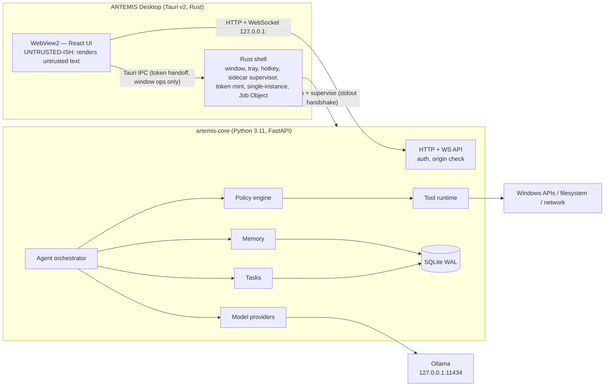
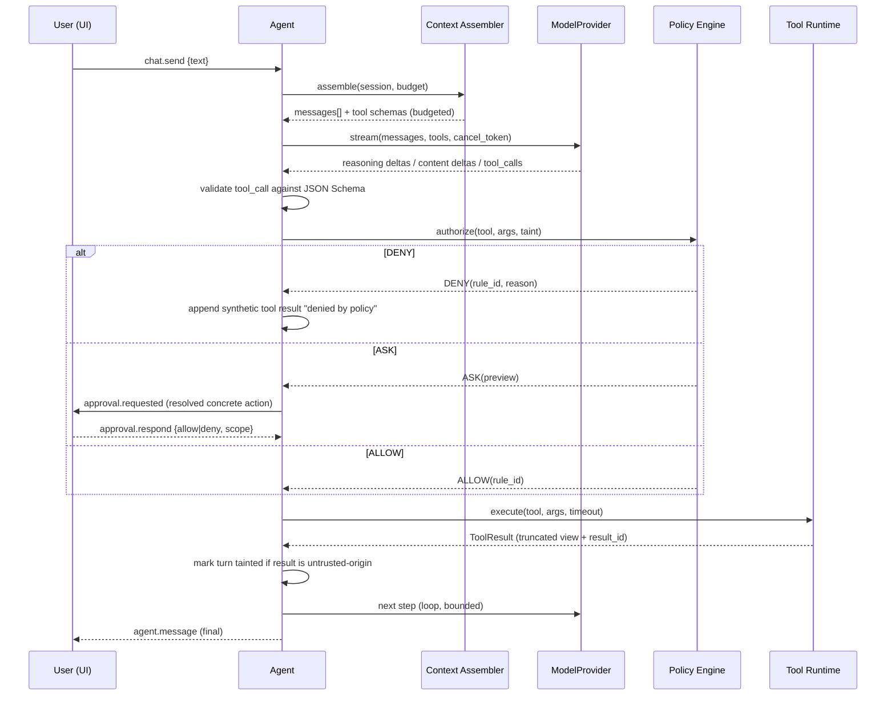

# ARTEMIS — System Architecture

Local-first personal AI assistant for Windows 11. Single user, single machine, no cloud dependency for core function.

**Governing principle:** the LLM proposes, the application validates, the policy engine authorizes, the tool executes, the user stays in control. No security control may depend on model behaviour.

## Document index

| Doc | Contents |
|---|---|
| `architecture.md` (this) | Topology, trust boundaries, config, storage, observability, failure modes, repo layout |
| `agent.md` | Agent loop, model abstraction, context assembly, task system |
| `tools.md` | Tool contract, registry, execution tiers, planned catalog |
| `security.md` | Threat model, policy engine, taint model, path rules, audit |
| `memory.md` | Memory kinds, schema, extraction, retrieval, user control |
| `voice.md` | STT/TTS/VAD interfaces, latency budget, GPU tenancy |
| `ui.md` | Frontend architecture, state model, motion contract |
| `api.md` | HTTP endpoints, WebSocket envelope, event catalog |
| `roadmap.md` | Phases with goals / deliverables / tests / non-goals |
| `decisions.md` | ADRs + prioritized risk register |

---

## 1. Process topology

Three processes. Two of them are ours.



### Why the frontend talks to Python directly (not proxied through Rust)

**Decision:** WebView → Python over loopback HTTP/WS, secured by a per-launch token + Origin allowlist.
**Reason:** streaming (token deltas, later PCM audio) through Tauri IPC would require re-implementing backpressure and framing in Rust for zero security gain — Rust would be a dumb pipe.
**Alternatives:** Rust proxy; pure-Rust backend (loses Python ML ecosystem).
**Tradeoff:** an open loopback port is an attack surface reachable by any local process and by any web page in the user's browser. Mitigated in §3. This is tracked as risk **R1 (CRITICAL)**.

### Rust shell responsibilities (deliberately small)

- Window/tray/global hotkey; single-instance guard.
- Mint a 256-bit random session token at launch; pass to Python via env `ARTEMIS_AUTH_TOKEN`.
- Spawn `artemis-core` as a sidecar with `--port 0 --host 127.0.0.1`; read one JSON line from its stdout: `{"port":52341,"pid":1234,"version":"..."}`.
- Assign the child to a **Windows Job Object** with `JOB_OBJECT_LIMIT_KILL_ON_JOB_CLOSE` so a crashed shell can never orphan the backend.
- Health-supervise (restart with backoff, max 3, then surface a fatal UI state).
- Expose exactly one Tauri command to the WebView: `get_backend_handle() -> {port, token, origin}`.

Rust performs **no** privileged assistant operations. It is not a tool host.

### Python core responsibilities

Everything else: API, agent, model providers, policy, tools, memory, tasks, voice, persistence. Tool execution lives here because tools are policy-gated in the same address space that owns the policy engine — no cross-process trust needed for the authorization decision itself.

---

## 2. Trust boundaries

| Zone | Trust | Rules |
|---|---|---|
| Windows user session | Trusted root | ARTEMIS runs as the logged-in user, **never elevated**. No admin ops, ever. |
| Rust shell | Trusted | Owns token + child lifecycle. No tool logic. |
| Python core | Trusted (TCB) | The Trusted Computing Base. Policy engine + path canonicalizer live here. |
| Loopback transport | Semi-trusted | Authenticated + origin-checked. Assume other local processes are hostile. |
| WebView / React | Semi-trusted | May *request* actions; may never *perform* them. Renders untrusted strings — never with `dangerouslySetInnerHTML`. |
| LLM output | **Untrusted input** | Parsed, schema-validated, policy-gated. Never `eval`'d, never used to build shell strings, never used to decide permissions. |
| Tool results (files, web, screen, other apps) | **Untrusted input** | Tainted (see `security.md` §4). Never treated as instructions. |
| Ollama | Semi-trusted local service | Loopback only. Treated as a compute service, not an authority. |

**Two invariants that must never be violated:**

1. *Authorization is a pure function of `(tool, validated_args, resolved_paths, taint_level, stored_grants, hard_deny_baseline)`.* Model text, memory content, and tool output are **not** inputs to it.
2. *The frontend cannot cause an action the backend would not authorize on its own.* Frontend requests carry no privilege beyond "the human clicked this."

---

## 3. Transport security (mandatory, Phase 1)

Every backend request must satisfy **all** of:

1. Socket bound to `127.0.0.1` on an ephemeral port. Never `0.0.0.0`.
2. `Authorization: Bearer <token>` (HTTP) or WS subprotocol `["artemis.v1","bearer.<token>"]` — browsers cannot set WS headers, so the subprotocol carries it. Constant-time compare.
3. `Origin` ∈ allowlist (`http://tauri.localhost`, plus `http://localhost:1420` in dev builds only). Reject missing Origin on WS. This is what stops a malicious web page from reaching the backend via the user's browser (DNS-rebinding/CSRF class).
4. `Host` header validated (anti-rebinding).
5. No CORS. No wildcard. No `credentials: include` patterns.

Token is never written to disk or logs. Rotated on every launch.

This is necessary but not sufficient: a hostile process running as the same user can read our memory/DB anyway. We are not defending against local malware with equal privilege — we are defending against **remote/web attackers**, **prompt injection**, and **accidental destruction**. Stated explicitly in `security.md` §1.

---

## 4. Component responsibilities

| Component | Responsibility | Must NOT |
|---|---|---|
| **API layer** | Auth, origin check, request validation, WS fan-out, session CRUD | Contain business logic |
| **Agent orchestrator** | Run loop, step/time budgets, cancellation, repair, event emission | Execute OS operations directly |
| **Context assembler** | Deterministic token-budgeted prompt construction | Exceed the budget; silently drop tiers without logging |
| **Model providers** | Normalize streaming/tool-calls/reasoning per backend | Leak provider-specific types upward |
| **Tool runtime** | Schema validation, execution tier selection, timeout, cancellation, result capture | Run a tool before the policy engine returns ALLOW |
| **Policy engine** | Deterministic ALLOW/ASK/DENY, grant store, hard-deny baseline | Read memory or model rationale |
| **Memory** | Store/retrieve/curate user knowledge with provenance | Influence policy decisions |
| **Task system** | Persist multi-step plans, progress, approvals, cancellation | Auto-resume side-effecting work after a crash |
| **Voice** | VAD → STT → agent → TTS pipeline, barge-in | Hold the GPU while the LLM is generating |
| **Event bus** | Typed, sequenced, ordered delivery to subscribers | Drop events silently |
| **Storage** | SQLite WAL, migrations, single-writer discipline | Be accessed outside repository modules |
| **Observability** | Structured logs, spans, audit trail | Log secrets, full file contents, or raw audio |
| **Config** | Layered config resolution | Weaken the hard-deny baseline |

---

## 5. Request lifecycle (canonical flow)



The DENY path **does not silently fail**: the model receives a structured error, the user sees the denial in the timeline, and the audit log records it.

---

## 6. Storage

**SQLite, WAL mode, one file:** `%LOCALAPPDATA%\ARTEMIS\artemis.db`.

Pragmas at open: `journal_mode=WAL`, `synchronous=NORMAL`, `foreign_keys=ON`, `busy_timeout=5000`.

**Concurrency rule:** one dedicated writer connection guarded by an `asyncio.Lock`; a small read-only connection pool for queries. All DB calls go through `anyio.to_thread` — never on the event loop. All access via `backend/artemis/storage/repositories/*.py`. No ORM: raw parameterized SQL + thin repositories. Migrations are numbered `.sql` files applied by a 60-line migrator (Alembic is disproportionate here).

Core tables (details in the owning docs):

`sessions`, `messages`, `runs`, `tool_calls`, `tool_results`, `approvals`, `policy_rules`, `policy_grants`, `audit_log`, `memories`, `memory_candidates`, `memory_links`, `tasks`, `task_steps`, `settings`, `schema_version`.

Large blobs (screenshots, full tool results, audio) are **files** under `%LOCALAPPDATA%\ARTEMIS\blobs\<yyyy-mm>\<uuid>` with a DB row pointing at them, subject to a retention policy. Never inline in SQLite.

**Future vector retrieval:** load the `sqlite-vec` extension (a single DLL) into the same database. No separate vector server, ever. See `memory.md` §6.

---

## 7. Configuration

Layered, later wins:

1. Code defaults (`config/defaults.py`) — includes the **hard-deny baseline**, which no later layer can weaken.
2. `%LOCALAPPDATA%\ARTEMIS\artemis.toml` — user-editable, hot-reload on change (watch + debounce).
3. Environment (`ARTEMIS_*`) — used by the shell for port/token/log level.
4. Runtime settings written from the UI → `settings` table.

Config is validated with Pydantic on load. **Invalid config fails loudly at startup with the offending key**; it does not fall back to defaults silently.

Policy rules live in the **database**, not TOML, so every change is auditable. TOML may only *tighten* permissions.

Representative keys:

```toml
[model]
provider = "ollama"
name     = "qwen3:8b"
num_ctx  = 8192          # VRAM-bounded, see decisions.md ADR-006
keep_alive = "30m"

[agent]
max_steps = 6
turn_wall_clock_s = 120
max_side_effect_calls_per_turn = 5

[context]
total_budget_tokens = 7000
reserve_output_tokens = 1024

[policy]
mode = "standard"        # standard | strict | permissive(dev only)

[filesystem]
allow_roots = ["%USERPROFILE%\\Documents", "%USERPROFILE%\\Downloads", "%USERPROFILE%\\Desktop"]
delete_mode = "recycle_bin"

[telemetry]
enabled = false          # local UI telemetry sampling; never network
```

---

## 8. Observability

**Structured JSON logs** (`structlog`) to `%LOCALAPPDATA%\ARTEMIS\logs\artemis-YYYYMMDD.jsonl`, rotated, 14-day default retention.

Every log line carries: `ts`, `level`, `event`, `run_id`, `session_id`, `component`, `duration_ms` where relevant.

A **run trace** must let you reconstruct, for any turn:
user request → model + params → context budget breakdown (tokens per tier) → memories retrieved (ids only) → tool requested → policy decision + rule_id → approval outcome → execution duration → result status → errors → final state.

**Redaction is structural, not regex-based:** fields are declared `sensitive=True` at the schema level and are replaced with `«redacted:<sha256[:8]>»`. Never logged: auth token, file *contents*, full web page text, raw audio, transcript text at INFO level (DEBUG only, opt-in), memory values (ids + kind only at INFO).

**Audit log** is separate from application logs — see `security.md` §7. It is append-only and user-inspectable in the UI.

**No network telemetry. Ever. No opt-out needed because there is nothing to opt out of.**

---

## 9. Failure and degraded modes

Rule: **fail visibly, name the subsystem, keep everything else working.** Never fabricate success.

| Failure | Detection | Behaviour |
|---|---|---|
| Ollama not running | `GET /api/version` on startup + on first use | `model.status{loaded:false}` → UI banner "Local model offline" with a *Start Ollama* action. Chat input disabled; memory/settings/audit remain browsable. |
| Model not pulled | `/api/tags` mismatch | Explicit "model `qwen3:8b` not installed" + the exact `ollama pull` command. No silent substitution. |
| GPU unavailable / VRAM exhausted | Ollama error or load >20s | Retry once at reduced `num_ctx`; if still failing, surface "running on CPU — responses will be slow" and continue. Degradation is announced, not hidden. |
| Model timeout | No token for `first_token_timeout_s` (20s) or exceeds turn budget | Cancel run, `agent.error{code:MODEL_TIMEOUT}`, partial text retained and marked incomplete. |
| Malformed tool call | Schema validation fails | Repair loop, max 2 attempts with the validation error fed back; then abort turn with `TOOL_CALL_UNPARSEABLE`. Never guess arguments. |
| Forbidden operation requested | Policy DENY | Structured denial to model, denial card in UI, audit entry. Model may not retry the same call (loop guard). |
| Tool failure | Non-zero/exception | Typed `ToolResult{status:"error"}` fed back once; the agent may adapt, but a second failure of the same tool ends the turn. |
| Tool timeout | Per-tool deadline | Subprocess killed (tree-kill), `status:"timeout"`, partial output discarded. |
| DB unavailable/corrupt | Open fails / integrity_check | **Hard fail at startup** with the DB path and a backup/repair instruction. Do not run memory-less and pretend to be fine. |
| STT/TTS unavailable | Binary/model missing | Voice controls disabled with a reason tooltip; text mode unaffected. |
| No internet | Web tool DNS/connect error | Web tools report `status:"unavailable"`; the agent must say it could not search rather than answering from memory as if it had. |
| Backend crash | Rust supervisor | Restart ≤3× with backoff; UI shows RECOVERING then FATAL. In-flight run marked `INTERRUPTED`. |

On startup, any `runs` or `tasks` left `RUNNING` are set to `INTERRUPTED`. **Side-effecting work is never auto-resumed.**

---

## 10. Hardware budget (i7-13620H / 16 GB / RTX 4050 6 GB)

**Single GPU tenant rule:** the LLM owns the GPU. Whisper runs on CPU (`small`/`base` int8 is ~real-time on this CPU). Piper is CPU-only. A future vision model **swaps with** the LLM rather than co-residing — see `voice.md` §5 and ADR-006.

| Resource | Target |
|---|---|
| VRAM | qwen3:8b Q4_K_M ≈ 5.0 GB + KV cache. `num_ctx=8192` default; `OLLAMA_FLASH_ATTENTION=1`, `OLLAMA_KV_CACHE_TYPE=q8_0`. Hard cap 16384 with an explicit slow-mode warning. |
| System RAM | Python core < 400 MB RSS idle; UI < 250 MB. |
| Idle CPU | < 1%. No polling loops. Telemetry sampling only while a subscriber is visible, ≤1 Hz. |
| Model residency | `keep_alive=30m` to avoid reloads; unload on battery-saver or after 30 min idle. |
| Animation | UI capped at 60 fps, paused when window unfocused/minimized; no persistent WebGL context (it competes with inference). |

Nothing runs at boot in Phase 1–7. Background scheduling arrives only with Phase 8 and is opt-in.

---

## 11. Repository layout

```
artemis/
├─ apps/desktop/                 # Tauri v2
│  ├─ src/                       # React + TS + Tailwind
│  │  ├─ core/                   # transport, ws client, event router
│  │  ├─ state/                  # zustand stores
│  │  ├─ features/               # conversation, approvals, tasks, memory, settings, telemetry
│  │  └─ ui/                     # primitives + motion system
│  └─ src-tauri/                 # Rust shell (sidecar supervisor, token, job object)
├─ backend/
│  └─ artemis/
│     ├─ api/                    # FastAPI routers, ws, auth, schemas
│     ├─ agent/                  # loop, context assembler, repair, budgets
│     ├─ models/                 # ModelProvider ABC, ollama provider, registry, parsers
│     ├─ tools/                  # contract, registry, runtime, workers, builtin/*
│     ├─ policy/                 # engine, rules, grants, path canonicalizer, taint
│     ├─ memory/                 # store, extraction, retrieval, curation
│     ├─ tasks/                  # model, executor
│     ├─ events/                 # bus, envelope, types
│     ├─ voice/                  # stt/tts/vad interfaces (Phase 7)
│     ├─ storage/                # db, migrations/, repositories/
│     ├─ obs/                    # logging, audit, tracing
│     └─ config/
├─ docs/
├─ scripts/                      # dev.ps1, build.ps1, seed policy
└─ tests/                        # backend pytest; policy fuzz suite
```

**Toolchain:** Python 3.11 + `uv` (fast, lockfile, Windows-friendly). Node 20 + pnpm. Rust stable. Backend packaged with PyInstaller **onedir** as a Tauri sidecar (onefile has multi-second cold-start extraction on Windows and worse AV false-positive behaviour).

---

## 12. Testing strategy (applies to every phase)

| Layer | Approach |
|---|---|
| Policy engine | **Highest priority.** Table-driven unit tests + Hypothesis fuzzing of path canonicalization (traversal, junctions, 8.3 names, ADS, UNC, device names, unicode). A permission bypass is the worst possible bug. |
| Model providers | Contract tests against a `FakeProvider`; recorded Ollama fixtures. No live-model assertions in CI. |
| Agent loop | Deterministic scripted providers: text-only, tool call, malformed, loop, timeout, cancel, depth-exceeded. |
| Context assembler | Snapshot tests on budget allocation; assert never exceeds `total_budget_tokens`. |
| Tools | Each tool: happy path, invalid args, timeout, permission-denied, path-escape attempt. |
| API | FastAPI `TestClient`; auth/origin rejection cases are mandatory. |
| Frontend | Vitest + Testing Library on stores and the state machine; event-replay fixtures. |
| E2E | Playwright against the Tauri build for the golden path (Phase 3+). |

CI runs on Windows. Every phase's exit criteria include its tests passing.
