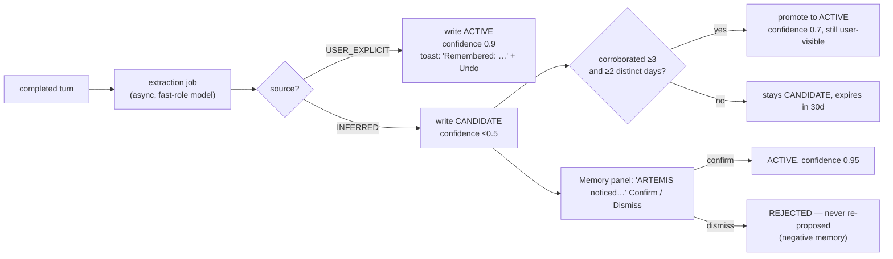

# ARTEMIS — Memory System

## 1. Responsibility & boundaries

Make ARTEMIS more useful over time by storing a *small, curated, inspectable* set of facts about the user — without fine-tuning and without dumping conversation history into the prompt.

Owns: memory CRUD, provenance, extraction pipeline, scoring/retrieval, decay, export/purge.

Does **not** own: conversation transcripts (that's `messages`), authorization (memory is *never* a policy input — see `security.md` §4), or the prompt itself (context assembler decides what fits).

**Non-goal:** remembering everything. A memory store that grows without bound is a liability (privacy, context cost, contamination). Target steady state: **< 500 active memories**.

---

## 2. Memory kinds

| Kind | Content | Lifetime | Context tier |
|---|---|---|---|
| `PROFILE` | Stable identity facts: name, timezone, occupation, locale, machine layout | Permanent until corrected | Tier 2 (pinned) |
| `PREFERENCE` | How ARTEMIS should behave: "concise answers", "no emojis", "metric units", TTS voice | Permanent until corrected | Tier 2 (pinned, capped at 12 active) |
| `SEMANTIC` | Facts about the user's world: "my main project is ARTEMIS", "my editor is VS Code", "Kai is my brother" | Long, decays if unused | Tier 3 (retrieved) |
| `EPISODIC` | Notable events: "on 2026-08-30 we cleaned Downloads and deleted 1.2 GB" | 90 days default, then summarized or dropped | Tier 3 (retrieved) |
| `TASK` | Working state for an active/recent task: chosen options, partial progress notes | Bound to task; purged 7 days after task end | Tier 6 (task state) |
| `BEHAVIORAL` | Inferred usage patterns: "usually opens VS Code around 09:00" | 30-day sliding window, requires corroboration | Tier 3, only if `confirmed` |

`PROFILE` and `PREFERENCE` are the only kinds that are always in context — and they are hard-capped in tokens. Everything else must earn its place by retrieval score.

---

## 3. Schema

```sql
memories(
  id            TEXT PRIMARY KEY,        -- m_<uuid7>
  kind          TEXT NOT NULL,           -- PROFILE|PREFERENCE|SEMANTIC|EPISODIC|TASK|BEHAVIORAL
  key           TEXT,                    -- optional stable slug: "user.name", "pref.verbosity"
  value         TEXT NOT NULL,           -- ≤400 chars, one atomic fact, written in third person
  source        TEXT NOT NULL,           -- USER_EXPLICIT|USER_CORRECTION|INFERRED|TOOL|SYSTEM
  provenance    TEXT NOT NULL,           -- TRUSTED|UNTRUSTED  (untrusted = derived from file/web/screen)
  origin_run_id TEXT,                    -- traceability back to the exact turn
  origin_quote  TEXT,                    -- ≤200 chars of the user utterance that justified it
  confidence    REAL NOT NULL,           -- 0..1
  status        TEXT NOT NULL,           -- ACTIVE|CANDIDATE|SUPERSEDED|REJECTED|DELETED
  superseded_by TEXT REFERENCES memories(id),
  pinned        INTEGER NOT NULL DEFAULT 0,
  sensitive     INTEGER NOT NULL DEFAULT 0,   -- excluded from context unless directly relevant
  use_count     INTEGER NOT NULL DEFAULT 0,
  last_used_at  TEXT,
  corroborations INTEGER NOT NULL DEFAULT 1,
  expires_at    TEXT,
  created_at    TEXT NOT NULL,
  updated_at    TEXT NOT NULL,
  embedding     BLOB                     -- NULL until Phase 6.5; no schema change needed later
);
CREATE VIRTUAL TABLE memories_fts USING fts5(value, key, content='memories', content_rowid='rowid');
memory_links(from_id, to_id, relation)   -- CONTRADICTS | REFINES | ABOUT_TASK
```

Rows are never hard-deleted by the system: `status='DELETED'` + value scrubbed, retained only as an audited tombstone for 30 days so "why did you forget that?" is answerable. **User-initiated deletion is immediate and irreversible** (value overwritten, row removed after the audit entry). Two different guarantees, both correct for their case.

---

## 4. Explicit vs inferred — the write path

The single most important rule: **inferred memories are never silently promoted to durable truth.**



Rules:
- **Explicit** = the user stated a preference/fact, or used `remember(...)`. Written `ACTIVE`, but with a non-blocking toast + Undo, so the user always knows. Never invisible.
- **Inferred** = the extraction model concluded something. `CANDIDATE` only. Promotion requires 3 corroborations across ≥2 distinct days. `BEHAVIORAL` memories additionally require explicit confirmation before they can enter context.
- **`REJECTED` is sticky.** A dismissed candidate is recorded so ARTEMIS doesn't re-propose it every week. Absence of a memory is itself information worth storing.
- **`provenance=UNTRUSTED`** if the turn was tainted. Such memories can never be `PROFILE` or `PREFERENCE`, are never pinned, and are labelled in the UI. Content read from a file cannot rewrite who ARTEMIS thinks you are.
- **Contradiction handling:** on write, check `key` and FTS-similar `ACTIVE` rows. A conflicting `USER_EXPLICIT` write supersedes the old one (`status='SUPERSEDED'`, `superseded_by` set) — history preserved, one truth active. A conflicting `INFERRED` write does **not** supersede an explicit memory; it is recorded as a `CONTRADICTS` link and surfaced for the user to resolve. Explicit always beats inferred.
- **Extraction runs after the response is delivered** (background, `fast` role, ~200 ms) so it never adds perceived latency. Input is the user+assistant text of that turn only — never reasoning traces, never raw untrusted blobs.
- **Extraction output is schema-constrained** and passes a rule filter that rejects: >400 chars, credentials/secret-shaped values, health/financial/biometric data unless explicitly volunteered with `remember()`, anything about third parties beyond a name+relation, and duplicates.
- **Nothing is extracted from a `sensitive session`** (a per-session toggle: no transcript retention, no memory extraction).

---

## 5. Retrieval

Runs per turn, budget ≤5 items / 400 tokens.

```
score = 0.45 * lexical_relevance      # FTS5 bm25, normalized
      + 0.20 * recency                # exp decay, 14-day half-life on last_used_at
      + 0.15 * confidence
      + 0.10 * usage_frequency        # log(1+use_count), normalized
      + 0.10 * kind_prior             # PREFERENCE/PROFILE high, EPISODIC low
```

Then: drop score < 0.25 · deduplicate by `key` · drop `sensitive` unless the query lexically matches it · drop `CANDIDATE`/`REJECTED` · take top 5 · bump `use_count`/`last_used_at`.

Query construction: current user message + last user message + active task title. Not the whole conversation (that makes every retrieval return the same generic items).

**Why FTS5 first, not a vector DB:** with <500 short memories, bm25 + recency is competitive, has zero extra dependencies, costs no VRAM (which the LLM needs), and is debuggable ("why was this retrieved?" has an answer). See ADR-007.

**Phase 6.5 upgrade path (only if measured recall is inadequate):** populate `memories.embedding` with a small CPU embedding model (e.g. `bge-small`, ~130 MB, CPU-only), load the `sqlite-vec` extension into the same DB file, and change `lexical_relevance` into a hybrid `0.6*vector + 0.4*bm25`. No new service, no new store, no schema migration beyond an index. The retrieval interface (`MemoryRetriever.retrieve(query, budget) -> list[ScoredMemory]`) is unchanged, so this is a one-module swap.

---

## 6. Decay & hygiene

A maintenance job runs on app start (and daily if the app stays open):
- Expire `CANDIDATE` older than 30 days without corroboration.
- Expire `EPISODIC` older than 90 days — but first, fold clusters of related episodics into one `SEMANTIC` summary if ≥5 share a topic.
- Purge `TASK` memories 7 days after task completion.
- Recompute `BEHAVIORAL` windows; drop unconfirmed patterns.
- If `ACTIVE` count > 500, surface a **review prompt** listing the lowest-scoring items. Never auto-delete `USER_EXPLICIT` memories — the user decides.
- `VACUUM`/`optimize` FTS index.

---

## 7. User control (Phase 6 deliverable, not deferred)

The Memory panel is a first-class feature, not a debug view:
- Browse/filter/search by kind, source, provenance, confidence, date.
- See **why** a memory exists: `origin_quote` + a link to the originating turn.
- Edit (creates a `USER_CORRECTION` supersede chain), delete, pin, mark sensitive.
- Confirm/dismiss candidates ("ARTEMIS noticed…").
- Export: `GET /v1/memories/export` → JSON (and CSV) containing everything, human-readable.
- **Purge all** with a typed confirmation; audited.
- A per-session **"don't remember this"** toggle.

Exposed tools (Phase 6): `remember(kind, value)` and `forget(query)` — both `MODERATE`, both emitting a `memory.updated` event so the user sees it happen. `forget` never deletes directly; it marks candidates for deletion and asks for confirmation when >1 item matches.

---

## 8. Events

`memory.updated{op: created|updated|superseded|deleted|candidate_added|candidate_resolved, memory_id, kind, summary}`. The UI shows a subtle, non-modal indicator — the user should always be aware when the assistant's model of them changes.

## 9. Security considerations

- **Memory is never a policy input.** Poisoned memory changes behaviour/tone, never permissions.
- Untrusted-provenance memories are quarantined out of the pinned tiers.
- Extraction is filtered for secrets; a memory value matching secret-shaped patterns is rejected and audited.
- Memory values are not logged at INFO (ids + kind only).
- Optional at-rest protection (Phase 6+): DPAPI-encrypt `value` for `sensitive=1` rows. Not encryption against local malware (same user can call DPAPI) — it prevents casual exposure of a copied `.db` file.
- Export files are written only to a user-chosen path via a normal save dialog, and the action is audited.

## 10. Failure behaviour

- FTS index corrupt → rebuild once; on repeated failure, fall back to `LIKE` scan (slow but correct) and warn.
- Extraction model unavailable → skip extraction, log; conversation is unaffected. Memory is an enhancement, never a dependency.
- Retrieval error → return empty set and log; the turn proceeds with no memories rather than failing.
- Write conflict → last-writer-wins on the same `key` with a `CONTRADICTS` link recorded.

## 11. Testing requirements

Explicit vs inferred routing · corroboration promotion thresholds · contradiction supersede chains (explicit beats inferred) · `REJECTED` stickiness · retrieval determinism and budget adherence · `sensitive` exclusion · untrusted provenance blocked from `PROFILE`/`PREFERENCE` · secret-shaped extraction rejected · decay job idempotency · export completeness (round-trip: export → purge → import equals original) · a 10 000-memory synthetic set retrieves in <50 ms.

## 12. Extension points

Vector hybrid retrieval (§5) · per-memory sharing scope if cloud providers are ever added (default: memories are **never** sent to a non-local provider without an explicit per-provider opt-in) · relationship graph queries via `memory_links` · proactive suggestions driven by `BEHAVIORAL` memories (Phase 8+, opt-in, always as a suggestion never an action).
