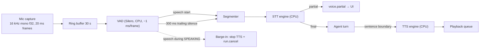

# ARTEMIS — Voice System

Not implemented before Phase 7. This document fixes the **interfaces, latency budget and GPU tenancy** so nothing built earlier has to be rewritten.

## 1. Responsibility & boundaries

Owns: audio capture, VAD, STT, TTS, playback, barge-in, voice session state.

Does **not** own: the agent loop (voice is just another input source producing a `USER`-trust turn), or policy (a spoken command has exactly the same authority as a typed one — **speech is not a privilege**).

**Critical rule:** a transcript is `USER` trust, but transcripts are *unreliable*. Therefore **destructive tool calls originating from a voice turn always require on-screen (or spoken-confirmation) approval**, and the approval card shows the transcript so the user can see a misrecognition. "Delete the invoices" must never execute on a mis-heard phrase.

---

## 2. Pipeline



**Where audio lives:** capture and playback run in the **Rust shell** (`cpal`), not Python. Reason: Windows audio device handling, low-latency callbacks and device-change events are markedly better in Rust than in Python; and it avoids a second Python audio dependency chain (PortAudio wheels are a known Windows pain point). Frames are forwarded to Python over the existing WebSocket as binary messages. Interface stays identical if we later move VAD into Rust for latency.

**Where inference lives:** Python core, CPU (§5).

---

## 3. Interfaces

```python
class VADEngine(Protocol):
    def process(self, frame: bytes) -> VadEvent: ...      # SPEECH_START|SPEECH|SILENCE|SPEECH_END
    def reset(self) -> None: ...

class STTEngine(Protocol):
    capabilities: STTCaps          # streaming, languages, model_size, device
    async def transcribe_stream(
        self, audio: AsyncIterator[bytes], cancel: CancelToken
    ) -> AsyncIterator[Transcript]: ...                    # Transcript{text, is_final, confidence, t0, t1}
    async def health(self) -> EngineHealth: ...

class TTSEngine(Protocol):
    capabilities: TTSCaps          # voices, streaming, sample_rate
    async def synthesize_stream(
        self, text: AsyncIterator[str], voice: VoiceConfig, cancel: CancelToken
    ) -> AsyncIterator[bytes]: ...                         # PCM chunks
    async def stop(self) -> None: ...

class WakeWordEngine(Protocol):                            # Phase 7.5, optional
    async def listen(self, audio: AsyncIterator[bytes]) -> AsyncIterator[WakeEvent]: ...
```

Initial implementations: `SileroVAD` · `FasterWhisperSTT` (CTranslate2, `small` int8, CPU) · `PiperTTS` (ONNX, CPU) · `OpenWakeWordEngine` (Phase 7.5).

**Engine choice rationale:** `faster-whisper` over `whisper.cpp` — same CTranslate2-class performance, a real Python API (no subprocess/stdio parsing), trivial int8 CPU quantization, easy device switching. Piper for TTS: ~40 MB voices, real-time factor ≈0.1 on this CPU, natural enough, fully offline, streams by sentence. Both are replaceable via the Protocols above; nothing else in the codebase imports them.

---

## 4. Voice session state machine

`VoiceState`: `OFF → IDLE → LISTENING → CAPTURING → TRANSCRIBING → (agent states) → SPEAKING → IDLE`

Modes: **push-to-talk** (Phase 7, default — a global hotkey, unambiguous and privacy-obvious) · **hands-free** (Phase 7.5, VAD-gated, explicit toggle, always-visible mic indicator) · **wake word** (Phase 7.5, opt-in).

Barge-in: user speech detected while `SPEAKING` → stop playback within one frame, flush the TTS queue, emit `run.cancel`, transition to `CAPTURING`. Barge-in must feel instant; it is the difference between a usable and an infuriating voice assistant.

Cancellation: hotkey or `Esc` cancels capture, transcription, generation and speech together.

---

## 5. GPU tenancy (hard constraint — 6 GB VRAM)

`qwen3:8b` Q4_K_M + KV cache leaves roughly 0.5–1 GB free. Whisper `small` on CUDA wants ~1 GB and would either fail to load or evict the LLM, causing a multi-second reload on the next turn. That is a worse outcome than slower STT.

**Rule: the LLM is the sole GPU tenant.** STT and TTS are CPU-only by default. The i7-13620H handles Whisper `small` int8 at roughly 0.25–0.4× real-time on 4 threads (a 4 s utterance ≈ 1.0–1.6 s) and Piper at ~0.1× real-time — both acceptable within the budget below. A `voice.stt.device = "cuda"` escape hatch exists for users who switch to a smaller LLM; it is off by default and warns.

Thread budget: STT 4 threads, TTS 2, leaving cores for Ollama's CPU-side work and the UI. Never oversubscribe — contention shows up as stuttering audio.

---

## 6. Latency budget (target: first audible response < 1.6 s after speech end)

| Stage | Target | Technique |
|---|---|---|
| VAD speech-end detection | 300 ms | fixed trailing-silence window, tunable |
| STT final | ≤700 ms | transcribe incrementally *during* speech; only the tail remains at speech end |
| Context assembly + memory retrieval | ≤50 ms | pre-warmed; retrieval starts on the *partial* transcript |
| LLM first token | ≤400 ms | model already resident (`keep_alive`), short prompt, `num_ctx` unchanged |
| TTS first chunk | ≤200 ms | synthesize the **first sentence** as soon as it's complete, don't wait for the full response |
| **Total** | **≈1.65 s** | |

Perceived-latency techniques that matter more than raw speed:
- **Stream everything.** Partial transcript appears while speaking; first audio plays while the model is still generating.
- **Sentence-level TTS pipelining** with a 2-sentence lookahead buffer.
- **Immediate acknowledgement**: the orb transitions to `THINKING` within 50 ms of speech end — visual feedback covers a lot of latency.
- **Pre-warm** STT and TTS models when voice mode is enabled, not on first use (first-use load is 1–3 s).
- Optional short filler ("Let me check…") **only** when a tool call is expected to exceed 1.5 s. Never gratuitously.

---

## 7. Events

Server→client: `voice.state{state}` · `voice.level{rms}` (≤20 Hz, only while listening) · `voice.partial{text}` · `voice.final{text, confidence}` · `voice.tts_started/tts_stopped` · `voice.error{code}`.
Client→server: `voice.start_capture` · `voice.stop_capture` · `voice.barge_in` · binary audio frames · `voice.set_config{voice, rate, volume, mode}`.

## 8. Security & privacy considerations

- **Microphone is off by default.** Enabling it is an explicit, persistent, visible setting.
- A **persistent, unmissable indicator** whenever the mic is live (window badge + tray icon change). Non-negotiable.
- **Raw audio is never persisted by default.** Frames live in a ring buffer and are discarded. A debug-only opt-in can retain the last N utterances locally with an explicit retention setting.
- Transcripts are conversation data: retained like text messages, excluded in a `sensitive session`, never logged at INFO.
- Wake-word detection runs **fully locally**; audio prior to the wake word is discarded and never transcribed.
- Voice grants no extra authority; destructive ops from a voice turn always require confirmation (§1).
- No network access in the voice path at all.

## 9. Failure behaviour

Mic unavailable/in use → `voice.error{MIC_UNAVAILABLE}`, voice controls disabled with the reason, text unaffected. STT model missing → voice input disabled, exact install instruction shown. TTS missing → text-only responses, clearly indicated. Device changed/unplugged mid-session → stop capture, notify, offer re-select. STT confidence below threshold → **show the transcript and ask for confirmation instead of guessing**. Audio glitch/underrun → drop frames, log, never block the agent.

## 10. Testing requirements

VAD segmentation on recorded fixtures (including noisy and music-background) · STT engine contract tests with a `FakeSTT` producing scripted partials/finals · barge-in cancels TTS and the run within 150 ms in a simulated harness · latency measured end-to-end on fixtures and asserted against the budget with 30 % headroom · low-confidence path requires confirmation · destructive voice command requires approval · mic-indicator state is driven by actual capture state (test the invariant, not the pixels).

## 11. Extension points

Streaming/whisper-large on GPU if the primary model shrinks · speaker verification to reject other voices (real security value for hands-free mode) · alternative TTS (Kokoro/XTTS) behind `TTSEngine` · emotion/prosody hints from `AssistantState` · multi-language auto-detect · a voice-only "eyes-free" interaction mode where every action is confirmed verbally.
